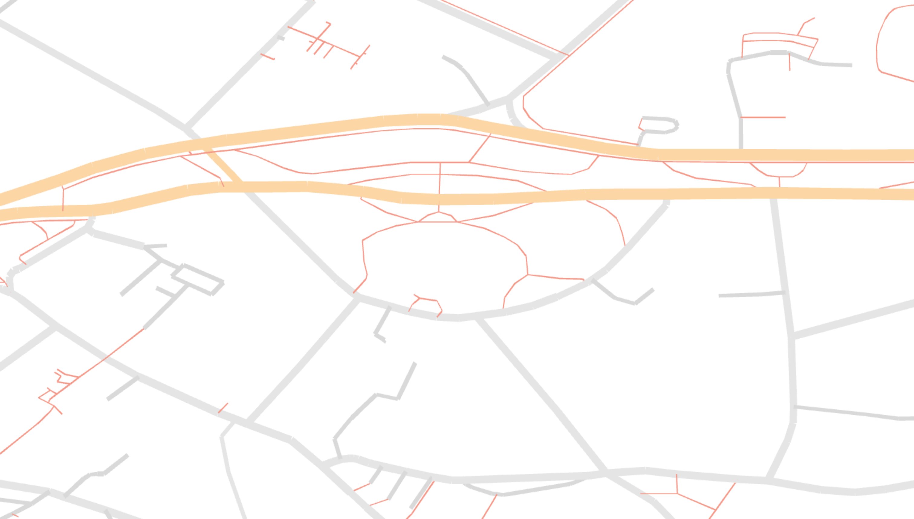

# osm-renderer-pt1

Code for the first blog post of my series about writing a WebGL vector renderer for OpenStreetMap data. Click the image for the blog-post.

## Getting Started

### Executing program

* `yarn install`
* `yarn dev`

## Authors

Gero Gerke  
[@Empty2k12](https://gero.dev/)

## License

This project is licensed under the UNLICENSE - see the LICENSE.md file for details

## Acknowledgments

* [Instanced Line Rendering Part I - Rye Terrell](https://wwwtyro.net/2019/11/18/instanced-lines.html)